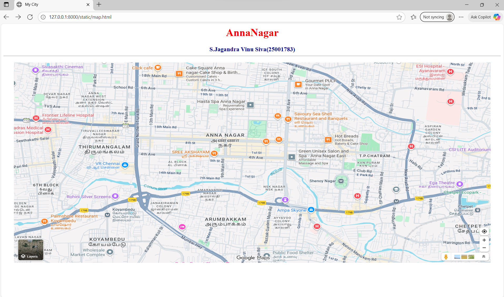
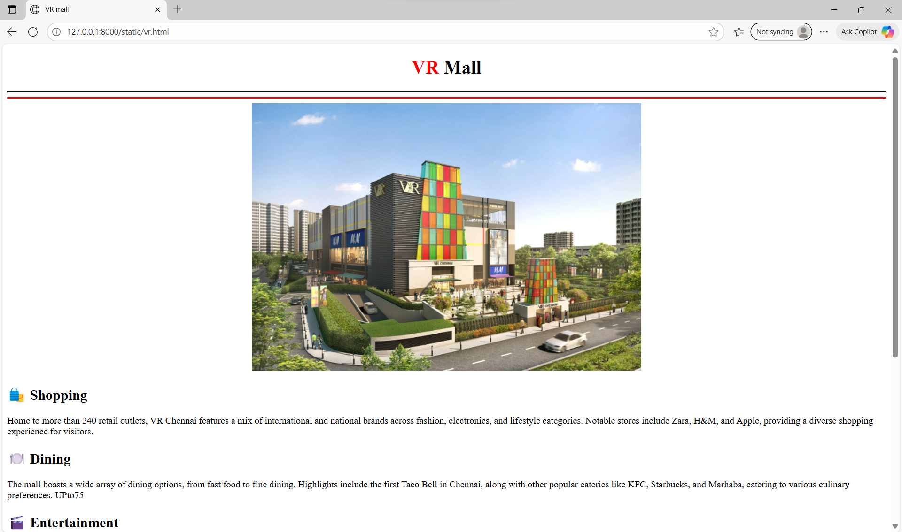
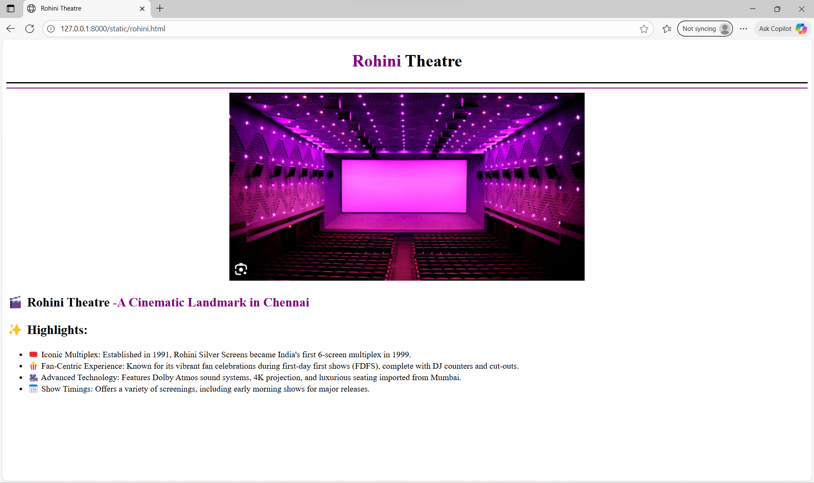
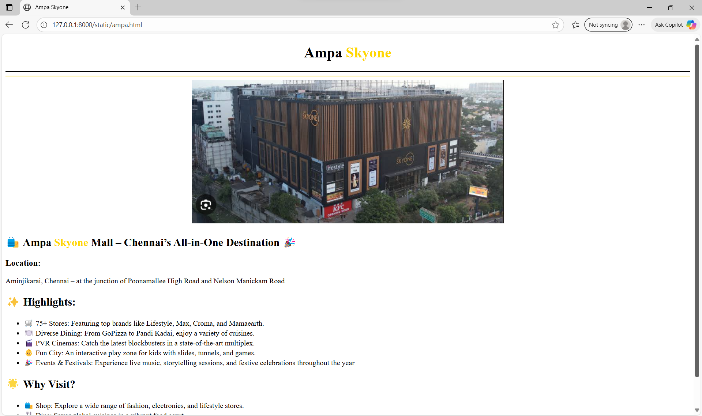
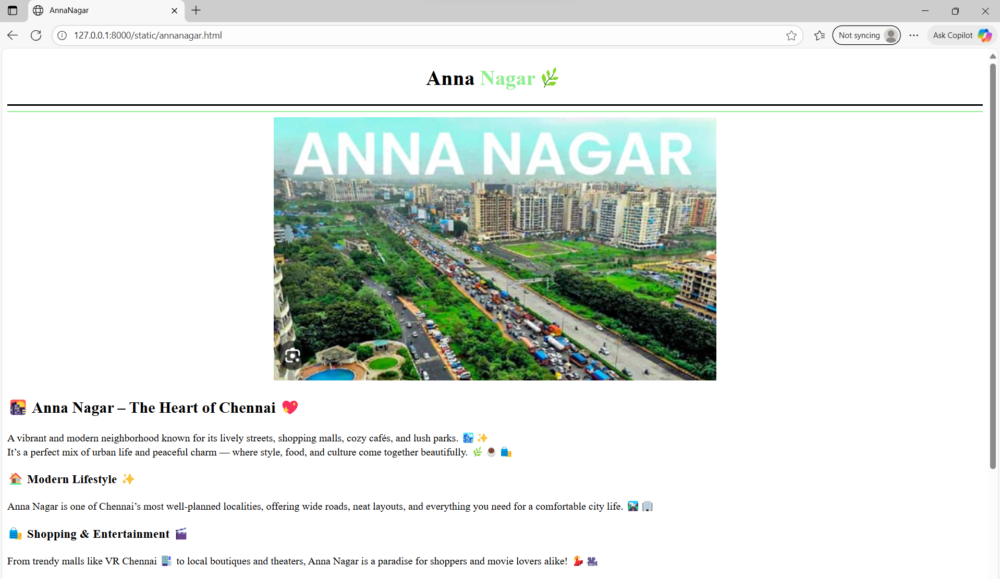
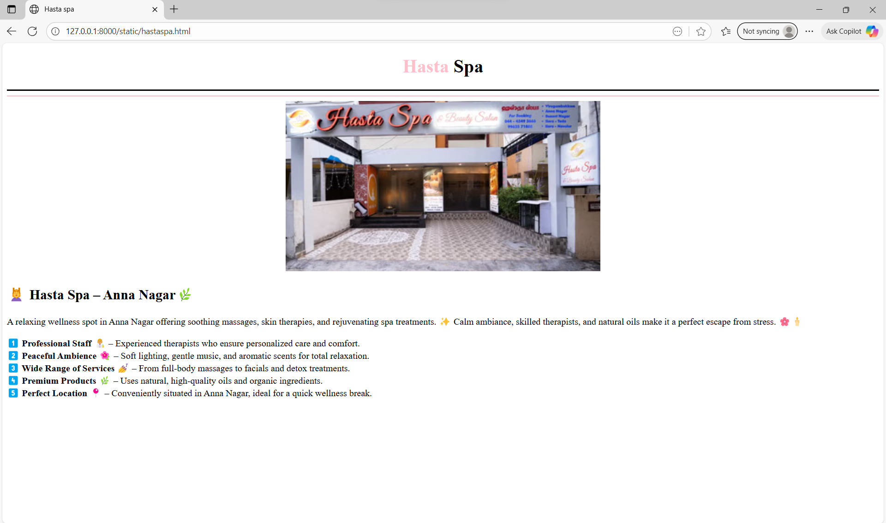

# Ex04 Places Around Me
## Date: 

## AIM
To develop a website to display details about the places around my house.

## DESIGN STEPS

### STEP 1
Create a Django admin interface.

### STEP 2
Download your city map from Google.

### STEP 3
Using ```<map>``` tag name the map.

### STEP 4
Create clickable regions in the image using ```<area>``` tag.

### STEP 5
Write HTML programs for all the regions identified.

### STEP 6
Execute the programs and publish them.

## CODE
```
map.html


<html>
    <head>
        <title>My City</title>
    </head>
    <body>
        <h1 align="center">
            <font color="red"><b>AnnaNagar</b></font>
        </h1>
        <h3 align="center">
            <font color="darkblue"><b>S.Jagandra Vinu Siva(25001783)</b></font>
            <hr>
        </h3>
        <center>
            
            <map name="MyCity">
                <area shape="circle" coords="300,300,50" title="VRmall" href="./vr.html">
                <area shape="circle" coords="290,410,50" title="Rohini Theatre" href="./rohini.html">
                <area shape="circle" coords="850,450,50" title="Ampa Skyone" href="./ampa.html">
                <area shape="circle" coords="680,150,50" title="Hasta spa" href="./hastaspa.html">
                <area shape="circle" coords="670,230,50" title="AnnaNagar" href="./annanagar.html">
            </map>
        </center>  
    </body>
</html>
 
 vr.html

 <!DOCTYPE html>
<html lang="en">
<head>
    <meta charset="UTF-8">
    <meta name="viewport" content="width=device-width, initial-scale=1.0">
    <title>VR mall</title>
</head>
<body>
    <h1 align="center">
        <font color="red"><b>VR</b></font>
        <font color="black"><b> Mall</b>
    </h1>
    <hr size="3" color="black">
    <hr size="3" color="red">
    <div style="text-align: center;">
        
    </div>
    <p>
        <h2>🛍️ Shopping</h2>

Home to more than 240 retail outlets, VR Chennai features a mix of international and national brands across fashion, electronics, and lifestyle categories. Notable stores include Zara, H&M, and Apple, providing a diverse shopping experience for visitors. 
<br>

<h2>🍽️ Dining</h2>

The mall boasts a wide array of dining options, from fast food to fine dining. Highlights include the first Taco Bell in Chennai, along with other popular eateries like KFC, Starbucks, and Marhaba, catering to various culinary preferences. 
UPto75

<h2>🎬 Entertainment</h2>

Entertainment at VR Chennai is anchored by a 10-screen PVR ICON multiplex, featuring Gold Class and IMAX formats for an enhanced movie-watching experience. 
VR Chennai
 Additionally, the mall offers a rooftop tennis court, swimming pool, and a fitness center for recreational activities.

<h2>🎮 Family Fun</h2>

For families, VR Chennai provides engaging attractions like Fun City, an indoor play area designed for children aged 2-13, and Timezone, an arcade offering a variety of games. 
<h2>🧘‍♀️ Wellness & Co-working</h2>

Visitors can unwind at Bounce Salon & Spa, located on the first floor, offering services like manicures, pedicures, and spa treatments. 
LBB
 The Hive, a co-working space within the mall, caters to entrepreneurs and freelancers seeking a productive environment. 
LBB

<h2>🎉 Events & Community</h2>

VR Chennai hosts a variety of events, including live music performances on weekends and a farmer's market every Sunday from 10 am to 7 pm, fostering a vibrant community atmosphere. 


<h2>🏛️ Architectural Highlights</h2>

The mall's design draws inspiration from South Indian temple architecture, featuring elements like gopurams, pillared mandapams, and murals depicting the Dashavatara. 
VR Chennai.
    </p>
</body>
</html>

rohini.html

<!DOCTYPE html>
<html lang="en">
<head>
    <meta charset="UTF-8">
    <meta name="viewport" content="width=device-width, initial-scale=1.0">
  <title>Rohini Theatre</title>
</head>
<body>
    <h1 align="center">
        <font color="purple">Rohini</font>
        <font color="black">Theatre</font>
    </h1>
    <hr size="3" color="black">
    <hr size="2" color="purple">
    <div style="text-align: center;">
        
    </div>
    <p>
        <h2>🎬 Rohini Theatre<b><font color="purple"> -A Cinematic Landmark in Chennai</font></b></h2>
        <h2>✨ Highlights:</h2>
        <ul>
        <li>🎟️ Iconic Multiplex: Established in 1991, Rohini Silver Screens became India's first 6-screen multiplex in 1999.</li>
        <li>🍿 Fan-Centric Experience: Known for its vibrant fan celebrations during first-day first shows (FDFS), complete with DJ counters and cut-outs.</li>
        <li>🎥 Advanced Technology: Features Dolby Atmos sound systems, 4K projection, and luxurious seating imported from Mumbai.</li>
        <li>📅 Show Timings: Offers a variety of screenings, including early morning shows for major releases.</li>
        </ul>
    </p>
    </body>
</html>

hastaspa.html
<!DOCTYPE html>
<html lang="en">
<head>
    <meta charset="UTF-8">
    <meta name="viewport" content="width=device-width, initial-scale=1.0">
    <title>Hasta spa</title>
</head>
<body>
    <h1 align="center">
        <font color="pink">Hasta</font>
        Spa
    </h1>
    <hr size="3" color="black">
    <hr size="2" color="pink">
    <div style="text-align: center;">
        
    </div>
    <h2>💆‍♀️ Hasta Spa – Anna Nagar🌿</h2>
    <p>A relaxing wellness spot in Anna Nagar offering soothing massages, skin therapies, and rejuvenating spa treatments. ✨ Calm ambiance, skilled therapists, and natural oils make it a perfect escape from stress. 🌸🕯️</p>
    <p><b>1️⃣ Professional Staff 👩‍🔬 </b>– Experienced therapists who ensure personalized care and comfort.<br>
<b>2️⃣ Peaceful Ambience 🌺 </b>– Soft lighting, gentle music, and aromatic scents for total relaxation.<br>
<b>3️⃣ Wide Range of Services 💅</b> – From full-body massages to facials and detox treatments.<br>
<b>4️⃣ Premium Products 🌿</b> – Uses natural, high-quality oils and organic ingredients.<br>
<b>5️⃣ Perfect Location 📍 </b>– Conveniently situated in Anna Nagar, ideal for a quick wellness break.</p>
</body>
</html>

annanagar.html

<!DOCTYPE html>
<html lang="en">
<head>
    <meta charset="UTF-8">
    <meta name="viewport" content="width=device-width, initial-scale=1.0">
    <title>AnnaNagar</title>
</head>
<body>
    <h1 align="center">
        Anna
        <font color="lightgreen">Nagar🌿</font>
    </h1>
    <hr size="3"color="black">
    <hr size="2" color="lightgreen">
    <div style="text-align: center;">
        
    </div>
    <h2>🌇 Anna Nagar – The Heart of Chennai 💖</h2>
    <p>A vibrant and modern neighborhood known for its lively streets, shopping malls, cozy cafés, and lush parks. 🏙️✨<br> It’s a perfect mix of urban life and peaceful charm — where style, food, and culture come together beautifully. 🌿☕🛍️</p>
    <h3>🏠 Modern Lifestyle ✨</h3>
    Anna Nagar is one of Chennai’s most well-planned localities, offering wide roads, neat layouts, and everything you need for a comfortable city life. 🛣️🏢
    <h3>🛍️ Shopping & Entertainment 🎬</h3>
    From trendy malls like VR Chennai 🏬 to local boutiques and theaters, Anna Nagar is a paradise for shoppers and movie lovers alike! 💃🎥
    <h3>☕ Food & Hangouts 🍕</h3>
    Whether it’s a cozy café, a fancy restaurant, or a street food corner — Anna Nagar never disappoints foodies. 🍔☕🍰
    <h3>🌳 Green & Peaceful 🍃</h3>
    Despite being in the middle of the city, it’s filled with parks and tree-lined avenues, making it calm and refreshing to walk around. 🌿🌼
    <h3>🚇 Well Connected 🚘</h3>
    With metro stations 🚇, bus routes 🚌, and easy access to major roads, traveling to and from Anna Nagar is super convenient! 🗺️✨
    
</body>
</html>

ampa.html

<!DOCTYPE html>
<html lang="en">
<head>
    <meta charset="UTF-8">
    <meta name="viewport" content="width=device-width, initial-scale=1.0">
    <title>Ampa Skyone</title>
</head>
<body>
    <h1 align="center">
        <font color="black">Ampa</font>
        <font color="gold">Skyone</font>
    </h1>
    <hr size="3" color="black">
    <hr size="2" color="gold">
    <div style="text-align: center;">
        
    </div>
    <h2>🛍️ Ampa <font color="gold">Skyone</font> Mall – Chennai’s All-in-One Destination 🎉</h2>
    <h3>Location:</h3><p> Aminjikarai, Chennai – at the junction of Poonamallee High Road and Nelson Manickam Road</p>
    <h2>✨ Highlights:</h2>
    <ul>
    <li>🛒 75+ Stores: Featuring top brands like Lifestyle, Max, Croma, and Mamaearth.</li>
    <li>🍽️ Diverse Dining: From GoPizza to Pandi Kadai, enjoy a variety of cuisines.</li>
    <li>🎬 PVR Cinemas: Catch the latest blockbusters in a state-of-the-art multiplex.</li>
    <li>👶 Fun City: An interactive play zone for kids with slides, tunnels, and games.</li>
    <li>🎉 Events & Festivals: Experience live music, storytelling sessions, and festive celebrations throughout the year</li> 
    </ul>
    <h2>🌟 Why Visit?</h2>
    <ul>
    <li>🛍️ Shop: Explore a wide range of fashion, electronics, and lifestyle stores.</li>
    <li>🍴 Dine: Savor global cuisines in a vibrant food court.</li>
    <li>🎬 Relax: Enjoy a cinematic experience with the latest movies.</li>
    <li>👨‍👩‍👧 Family-Friendly: A perfect spot for family outings with activities for all ages.</li>
    </ul>
    
</body>
</html>


```


## OUTPUT







## RESULT
The program for implementing image maps using HTML is executed successfully.


## RESULT
The program for implementing image maps using HTML is executed successfully.
